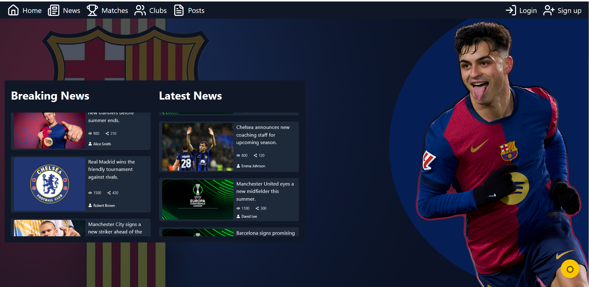
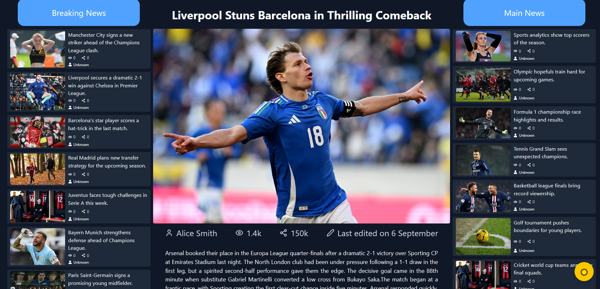

Sport News

Sport News is a modern web application built with Vite and TypeScript, providing a fast and dynamic platform to showcase sports news.

---

Getting Started

Prerequisites

Before you begin, ensure you have:

- Node.js v16 or higher
- npm or Yarn installed

Installation

Clone the repository and install dependencies:

git clone https://github.com/Softsword2025/Sport-News.git
cd Sport-News
npm install

Start the development server:

npm run dev

Your application will be available at: https://sport-news-blush-nine.vercel.app

---

Project Structure

Sport-News/
│
├── public/          # Static assets (images, icons, etc.)
├── src/
│   ├── assets/      # Images, logos
│   ├── components/  # Reusable React components
│   ├── pages/       # Page components
│   └── styles/      # CSS / Tailwind styles
└── package.json

---

Scripts

Command              | Description
---------------------|------------------------------------
npm install           | install packages and dependencies
npm run dev           | Start development server
npm run build         | Build production version
npm run preview       | Preview production build

---

Screenshots

---

Contributing

Contributions are welcome! Please fork the repository and submit a pull request for any enhancements or bug fixes.

---

License

This project is licensed under the MIT License.

